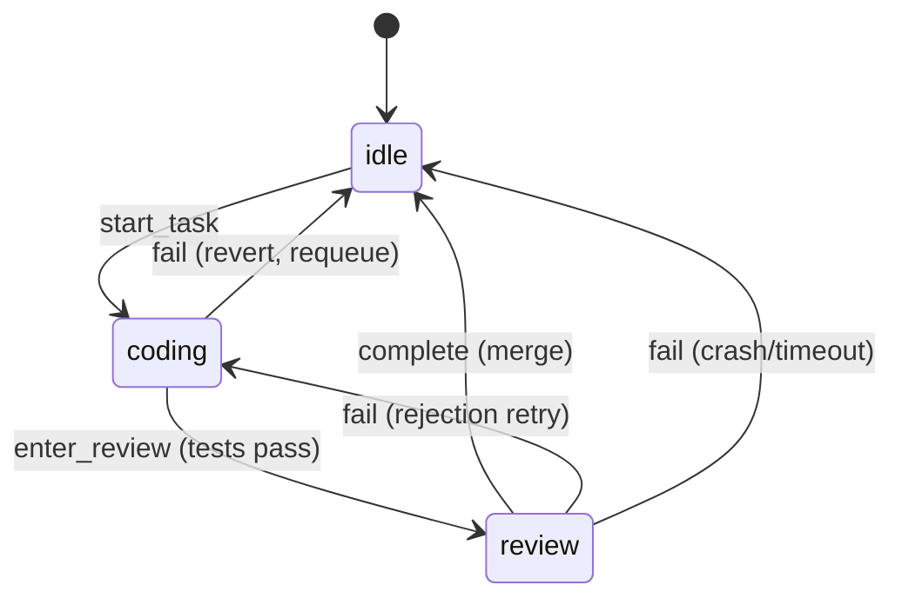

# OpenSprint — Product Requirements Document

**Version:** 2.1
**Date:** February 17, 2026
**Status:** Draft

---

## 1. Executive Summary

OpenSprint is a web application that guides users through the complete software development lifecycle using AI agents. It provides a structured, five-phase workflow — **SPEED**: Sketch, Plan, Execute, Evaluate, and Deliver — that transforms high-level product ideas into working software with minimal manual intervention.

The platform pairs a browser-based interface with a background agent CLI, enabling AI to autonomously execute development tasks while keeping the user in control of strategy and direction. The core philosophy is that humans should focus on _what_ to build and _why_, while AI handles _how_ to build it.

OpenSprint supports multiple agent backends (Claude, Cursor, and custom CLI agents), comprehensive automated testing including end-to-end and integration tests, configurable human-in-the-loop thresholds, and full offline operation for users with local agent setups.

---

## 2. Problem Statement

Building software with AI today is fragmented and unstructured. Developers use AI coding assistants for individual tasks, but there is no cohesive system that manages the full journey from idea to deployed product. This leads to several persistent problems:

- **Lack of architectural coherence:** AI-generated code often lacks a unified vision because each prompt is handled in isolation, without awareness of the broader system design.
- **No dependency tracking:** When building features in parallel, there is no mechanism to ensure that work on one feature accounts for dependencies on another.
- **Manual orchestration overhead:** Users spend significant time managing prompts, context windows, and task sequencing rather than focusing on product decisions.
- **No feedback loop:** There is no structured way to validate completed work and feed findings back into the development process.

OpenSprint solves these problems by providing an end-to-end platform that maintains context across the entire lifecycle and automates the orchestration of AI development agents.

---

## 3. Goals & Success Metrics

### 3.1 Primary Goals

1. Reduce the time from idea to working prototype by 10x compared to traditional AI-assisted development workflows.
2. Enable non-engineers to ship production-quality software by handling technical complexity behind the scenes.
3. Maintain architectural coherence across an entire project by flowing design decisions through every phase.
4. Create a self-improving development flywheel where validation feedback automatically triggers corrective action.

### 3.2 Success Metrics

| Metric                                | Target                                     | Measurement Method                 |
| ------------------------------------- | ------------------------------------------ | ---------------------------------- |
| Time from idea to working prototype   | < 1 day for standard web apps              | End-to-end session timing          |
| User intervention rate during Execute | < 10% of tasks require manual input        | Task completion telemetry          |
| Sketch-to-code fidelity               | > 90% alignment with PRD                   | Automated PRD compliance checks    |
| Feedback loop closure time            | < 30 min from bug report to fix deployed   | Evaluate-to-Execute cycle tracking |
| First-time user task completion       | > 80% complete a full Sketch-Execute cycle | Onboarding funnel analytics        |
| Test coverage                         | > 80% code coverage with passing E2E tests | Automated coverage reporting       |

---

## 4. User Personas

### 4.1 The Product-Minded Founder

A non-technical founder with a clear product vision who wants to build an MVP without hiring a development team. They understand what they want to build but need AI to handle the engineering. They value speed, clear communication about what is being built, and the ability to provide feedback without writing code.

### 4.2 The Solo Developer

An experienced developer who wants to multiply their output. They can code but want to delegate routine implementation to AI while focusing on architecture and product decisions. They value transparency into what the AI is doing, the ability to intervene when needed, and high-quality code output.

### 4.3 The Agency / Consultancy

A small team that builds software for clients. They need to move quickly from client requirements to working software, maintain multiple projects simultaneously, and provide clients with visibility into progress. They value the structured workflow for client communication and the ability to run multiple projects in parallel.

---

## 5. System Architecture

### 5.1 Architecture Overview

OpenSprint consists of three primary layers: a web-based frontend, a backend API server, and a background agent CLI that executes development work. The frontend communicates with the backend via WebSockets for real-time updates and REST APIs for CRUD operations. The backend orchestrates agent CLI instances, manages project state, and maintains the living PRD.

OpenSprint is designed to run entirely offline. The web frontend and backend API server run locally on the user's machine. When using a local agent CLI (such as a locally-hosted LLM), the entire development loop — from Sketch through Deliver — operates without any internet connectivity. The task store is file-based (SQLite at ~/.opensprint/tasks.db) and inherently offline-compatible with no special synchronization logic required.

### 5.2 Technology Stack

**Backend:** Node.js with TypeScript. This provides a shared language and type system with the React frontend, mature WebSocket support, and robust subprocess management for agent CLIs via `child_process`. The task store (TaskStoreService) runs in-process with no external CLI.

**Frontend:** React with TypeScript.

### 5.3 Core Components

| Component           | Technology                                     | Responsibility                                                                                                                                                                                                                                                                                                                                                                                                                                       |
| ------------------- | ---------------------------------------------- | ---------------------------------------------------------------------------------------------------------------------------------------------------------------------------------------------------------------------------------------------------------------------------------------------------------------------------------------------------------------------------------------------------------------------------------------------------- |
| Web Frontend        | React + TypeScript                             | User interface for all five phases; real-time agent monitoring; project management                                                                                                                                                                                                                                                                                                                                                                   |
| Backend API         | Node.js + TypeScript                           | Project state management, WebSocket relay, PRD versioning, agent orchestration                                                                                                                                                                                                                                                                                                                                                                       |
| Agent CLI           | Pluggable (Claude, Cursor, Custom)             | Executes development tasks: code generation, testing, debugging                                                                                                                                                                                                                                                                                                                                                                                      |
| Orchestration Layer | Node.js (custom, deterministic)                | Always-on agent lifecycle management (spawn, monitor, timeout), context assembly, Summarizer invocation, retry logic, code review triggering. Owns all critical git and task-store operations (worktree, commit, merge, task creation, state transitions). Serialized git commit queue for main-branch operations (Section 5.9). Event-driven dispatch with 5-minute watchdog. Crash recovery via persistent state. See Sections 5.5, 5.7, 5.8, 5.9. |
| Task store          | sql.js (WASM SQLite at ~/.opensprint/tasks.db) | Task storage, dependency tracking (blocks/related/parent-child/discovered-from), ready-work detection and prioritization via `TaskStoreService.ready()`, agent assignment via `assignee` field, hierarchical epic/task IDs (e.g. os-xxxx.1), persistence via save-to-disk after writes. No external CLI.                                                                                                                                             |
| Version Control     | Git                                            | Code repository management, branch-per-task strategy                                                                                                                                                                                                                                                                                                                                                                                                 |
| Test Runner         | Configurable (Jest, Playwright, etc.)          | Automated test execution and coverage reporting                                                                                                                                                                                                                                                                                                                                                                                                      |
| Deployment          | Expo.dev / Custom pipeline                     | Automated deployment for supported platforms                                                                                                                                                                                                                                                                                                                                                                                                         |

### 5.4 Task Store Details

The **task store** (TaskStoreService backed by sql.js at `~/.opensprint/tasks.db`) provides the persistence, dependency, and scheduling layer. OpenSprint's orchestration layer calls it in-process; there is no external CLI.

**What the task store provides (and OpenSprint uses directly):**

- Issue CRUD with priorities (0-4), statuses (open/in_progress/closed/blocked), assignees, labels, and types (bug/feature/task/epic/chore)
- Four dependency types: blocks, related, parent-child, discovered-from
- `TaskStoreService.ready()` — finds tasks with no open blockers, sorted by priority. This is OpenSprint's execution queue — the orchestrator calls `ready()` and picks the first result
- `assignee` field — the orchestrator uses `TaskStoreService.update(id, { assignee: 'agent-<id>' })` to track which agent is working on a task
- Hierarchical child IDs (e.g., `os-a3f8.1`, `os-a3f8.2`) for epic → task breakdown
- Hash-based collision-resistant IDs
- Save-to-disk after each write batch; orchestrator manages git persistence for the repo (Section 5.9)
- Full audit trail of every change

**Planning state via epic status:** Epics can be `blocked` (plan not approved), `open` (approved), or `closed` (complete). When an epic has `status: "blocked"`, all its child tasks are excluded from `ready()` and show "Planning" in the UI. When the user clicks "Execute!", the orchestrator sets the epic to `status: "open"` via `TaskStoreService.update`, making child tasks eligible for execution based on their own inter-task dependencies. No separate gate task exists.

**What OpenSprint's orchestration layer adds:**

- Agent lifecycle management (spawn, monitor, 10-min timeout, teardown)
- Context assembly with Summarizer invocation when thresholds exceeded
- Two-agent Coder/Reviewer cycle (Section 7.3.2, 12.5)
- Retry and progressive backoff (Section 9)
- Serialized git commit queue for all main-branch operations (Section 5.9)
- Explicit task-store persistence (save-to-disk after each write batch)

### 5.5 Orchestrator Trust Boundary

**The orchestrator is a deterministic Node.js process — it executes scripted logic, never LLM inference.** Agents are non-deterministic and may omit, misinterpret, or fail to execute instructions, or be terminated unexpectedly. Any operation that affects project state, version control, or workflow progression must be performed by the orchestrator in code — never delegated to agent prompts.

**Critical operations (orchestrator-only):**

| Operation                    | Phase(s)       | Why Orchestrator Must Own It                                                                                                                         |
| ---------------------------- | -------------- | ---------------------------------------------------------------------------------------------------------------------------------------------------- |
| Worktree + branch management | Execute        | Agent might leave repo in inconsistent state; worktree creation/cleanup must be deterministic                                                        |
| Committing and merging       | Execute        | Agent might forget, commit partially, or merge incorrectly; all git ops on main serialized via commit queue (Section 5.9)                            |
| Triggering the next agent    | All            | Agents have no mechanism to invoke the orchestrator; workflow progression is orchestrator-driven                                                     |
| Task store state transitions | Execute        | `TaskStoreService.update`, `close` — invoked by orchestrator based on agent _output_, not agent _actions_                                            |
| Task creation                | Plan, Evaluate | `TaskStoreService.create` / `createMany`, `addDependency` / `addDependencies` — agents propose as structured data; orchestrator creates actual tasks |
| PRD file updates             | Plan, Evaluate | Agents propose updates; orchestrator writes and commits. **Exception:** Dreamer writes `prd.json` directly (user-supervised)                         |
| Epic unblock on Execute!     | Plan           | "Execute!" sets epic `status: "open"` via `TaskStoreService.update` — a scripted action triggered by UI button                                       |

**Agent responsibilities:** Agents produce _outputs_ — code files, `result.json`, structured data (task proposals, PRD updates, feedback categorizations). The orchestrator reads these outputs and performs all corresponding critical operations. Agents never touch git or the task store directly.

### 5.6 Data Flow

The data flows through the system in a unidirectional pipeline with feedback loops. User input in Sketch creates or updates the PRD. The PRD is decomposed in Plan into feature-level Plan markdown files, each representing an epic. In Execute, Plan markdowns are further broken into individual tasks stored in the task store for dependency tracking. Agent CLIs pick up tasks, execute them, and report results back through the system. In Evaluate, user feedback is mapped back to the relevant Plan epic and Build tasks, creating new tickets as needed. Any changes at any phase propagate upstream to update the living PRD, ensuring the document always reflects the current state of the project.

### 5.7 Orchestrator Lifecycle & Always-On Loop

**One orchestrator per project, always running.** When the OpenSprint backend starts, it launches an orchestrator instance for each registered project. The orchestrator continuously monitors for available work and dispatches agents — there is no manual "start build" action.

**Single-agent constraint applies only to Coder/Reviewer (v1).** Each project runs one Coder or Reviewer at a time. All other agents (Dreamer, Planner, Harmonizer, Analyst, Summarizer, Auditor) can run concurrently with each other and with the Coder/Reviewer, since they don't touch code branches.

**Event-driven with watchdog polling:** The orchestrator triggers agents on events (task completion, feedback submission, Plan execution). A **watchdog timer** runs every 5 minutes to catch edge cases: it queries the task store's `ready()`, checks for a running Coder/Reviewer, starts one if tasks are waiting, and terminates any agent that has been inactive for 10 minutes (Section 9.4).

### 5.8 Orchestrator State Persistence & Recovery

The orchestrator maintains its state in a local file at `.opensprint/orchestrator-state.json` (added to `.gitignore`). This file is updated atomically on every state transition and contains:

```json
{
  "active_task": {
    "task_id": "os-a3f8.2",
    "phase": "coding",
    "agent_pid": 12345,
    "branch": "opensprint/os-a3f8.2",
    "worktree_path": ".opensprint/worktrees/os-a3f8.2",
    "started_at": "2026-02-14T10:30:00Z",
    "last_output_at": "2026-02-14T10:32:15Z"
  },
  "last_watchdog_run": "2026-02-14T10:35:00Z",
  "pending_feedback_categorizations": []
}
```

**Attempt tracking via task labels:** The cumulative attempt count for each task is stored as a task label in the format `attempts:<N>` (e.g., `attempts:3`). The orchestrator reads and updates this via `TaskStoreService.addLabel(id, 'attempts:<N>')` after each attempt. This keeps attempt history co-located with the task and is fast to read without parsing comment history.

**On startup recovery:** The orchestrator reads `orchestrator-state.json`:

1. **No active task:** Normal startup — begin event loop and watchdog.
2. **Active task, PID alive:** Resume monitoring.
3. **Active task, PID dead:** Auto-recover — revert worktree (`git -C <worktree_path> reset --hard`), remove worktree and branch, add failure comment to task, re-queue task as `open`, persist task store (Section 5.9), and resume the loop.

### 5.9 Git Concurrency Control

Multiple concurrent agents trigger operations that commit to git on the main branch: PRD updates, Dreamer writes, and worktree merges. Task data lives in the global store (`~/.opensprint/tasks.db`) and is persisted by the backend after each write; no task data is committed to the repo. Simultaneous commits would contend on `.git/index.lock`. The solution is a **serialized git commit queue**.

**Commit queue:** The orchestrator owns all git operations on main through an in-process async FIFO queue with one worker. Any component that needs to commit to main enqueues a job rather than running git commands directly.

| Operation               | Trigger                                                           | Commit Message Pattern                       |
| ----------------------- | ----------------------------------------------------------------- | -------------------------------------------- |
| Task store save         | After task creation batch, status transitions, dependency changes | In-process; no git commit for task data      |
| PRD update (Harmonizer) | After orchestrator writes Harmonizer's proposed updates           | `prd: updated after Plan <plan-id> built`    |
| PRD update (Dreamer)    | After Dreamer modifies `prd.json` during conversation             | `prd: Sketch session update`                 |
| Worktree merge          | After Reviewer approves a task                                    | `merge: opensprint/<task-id> — <task title>` |

The Dreamer writes `prd.json` directly but does not commit; the orchestrator detects the change and enqueues a commit job. If a commit job fails, it is retried once; if it fails again, the error is logged and the next job proceeds — in-memory state is still correct, and the next successful commit captures accumulated changes.

---

## 6. Project Setup & Configuration

### 6.1 Home Screen & Project Management

OpenSprint opens to a home screen that lists all existing projects as cards, each showing the project name, last-modified date, current phase, and overall progress. A prominent "Create New Project" button starts the project setup wizard.

Once inside a project, the project name appears at the top-left of the navbar and functions as a dropdown selector. Clicking it reveals a list of all projects, allowing the user to rapidly switch between projects without returning to the home screen. Theme (light/dark/system) is configurable from project settings (Display section; see 6.6).

### 6.2 Project Setup Wizard

Creating a new project follows a sequential wizard:

1. **Project name** — basic metadata.
2. **Agent configuration** — select Planning Agent Slot and Coding Agent Slot (see 6.3).
3. **Deployment configuration** — select deployment mode (see 6.4).
4. **Human-in-the-loop preferences** — configure autonomy thresholds (see 6.5).
5. **Repository initialization** — OpenSprint creates a git repo, creates the `.opensprint/` directory structure in the repo, and adds `.opensprint/orchestrator-state.json` and `.opensprint/worktrees/` to `.gitignore`. Task data is stored globally in `~/.opensprint/tasks.db` (see Section 5.9).

After setup, the user lands directly in the Sketch tab.

### 6.3 Agent Configuration

Users configure two agent slots during project setup. Both use the same invocation mechanism — OpenSprint calls the user-selected agent's API or CLI. The only difference is which agent/model is used.

**Planning Agent Slot** (used by: Dreamer, Planner, Harmonizer, Analyst, Summarizer, Auditor):

- Powers all non-coding agent roles. Each named agent receives a specialized prompt and produces a role-specific output format (see Section 12), but all share the same underlying model configuration.
- Options: Claude (select model: e.g., Sonnet, Opus), Cursor (select model from available options), or Custom (user provides CLI command).
- When Claude or Cursor is selected, OpenSprint queries the provider's API for available models and populates a model dropdown.

**Coding Agent Slot** (used by: Coder, Reviewer):

- Powers task implementation and code review.
- Same options as Planning Agent Slot, configured independently.
- Users may choose the same agent/model for both slots, or different ones (e.g., Opus for planning, Sonnet for coding to manage costs).

**Named agent roles:**

| Agent      | Slot     | Phase             | Purpose                                                                        |
| ---------- | -------- | ----------------- | ------------------------------------------------------------------------------ |
| Dreamer    | Planning | Sketch            | Multi-turn PRD creation and refinement via chat                                |
| Planner    | Planning | Plan              | Decomposes PRD into features and tasks; outputs indexed task list              |
| Harmonizer | Planning | Plan (Execute!)   | Reviews shipped Plan against PRD; proposes PRD section updates                 |
| Analyst    | Planning | Evaluate          | Categorizes feedback; maps to epics; proposes new tasks                        |
| Summarizer | Planning | Execute           | Condenses context when dependencies or Plan exceed thresholds                  |
| Auditor    | Planning | Plan (Re-execute) | Audits current app capabilities and generates delta task list for re-execution |
| Coder      | Coding   | Execute           | Implements tasks and writes tests                                              |
| Reviewer   | Coding   | Execute           | Validates implementation against spec; approves or rejects                     |

The agent configuration can be changed at any time from project settings. When switching the Coding Agent Slot mid-project, all pending tasks in the Ready state will be picked up by the newly selected agent. In-progress tasks will complete with their originally assigned agent.

### 6.4 Deployment Configuration

OpenSprint supports two deployment modes that users configure during project setup:

- **Expo.dev integration (default for mobile/web):** OpenSprint can automatically deploy to Expo.dev for React Native and web projects. The system manages EAS Build configuration, over-the-air updates, and preview deployments for the Evaluate phase. Each completed Execute cycle triggers an automatic preview deployment. Requires internet connectivity.
- **Custom deployment pipeline:** Users can connect their own deployment pipeline by specifying a deployment command or webhook URL. OpenSprint will trigger this pipeline after successful Execute completion and test passage. This supports any CI/CD system (GitHub Actions, Vercel, Netlify, AWS, etc.).

### 6.5 Human-in-the-Loop Configuration

OpenSprint is designed to operate as an autonomous flywheel, but users have granular control over when the system pauses for human input. During project setup (and adjustable at any time), users configure their autonomy preferences via a series of checkboxes organized into three decision categories.

#### 6.5.1 Decision Categories

| Category                 | What It Covers                                                                                                                                                                                            | Default   |
| ------------------------ | --------------------------------------------------------------------------------------------------------------------------------------------------------------------------------------------------------- | --------- |
| Scope Changes            | Any modification that adds, removes, or substantially alters a feature in the PRD. This includes changes triggered by Evaluate feedback that the AI determines represent new scope rather than bug fixes. | Automated |
| Architecture Decisions   | Technology stack changes, new external service integrations, database schema modifications, API contract changes, and significant refactors that alter system structure.                                  | Automated |
| Dependency Modifications | Changes to task ordering, adding new dependencies between epics, splitting or merging tasks, and re-prioritization of the execution queue.                                                                | Automated |

**Note:** Test failures and agent errors are always handled automatically via progressive backoff (retry, requeue, deprioritize, and eventually block — see Section 9.1). This is not configurable, as the hands-off recovery strategy is core to the flywheel design.

#### 6.5.2 Notification Behavior

For each category, users choose one of three modes:

- **Automated:** The AI makes the decision autonomously and notifies the user after the fact via a log entry. The flywheel continues without pausing.
- **Notify and proceed:** The AI makes the decision, sends a real-time notification to the user, and continues without waiting. The user can review and override retroactively if needed.
- **Requires approval:** The AI prepares a recommendation with full context, pauses the affected work stream, and waits for explicit user approval before proceeding. Other non-blocked work continues in parallel.

### 6.6 Appearance & Theme

OpenSprint supports Light, Dark, and System (follows OS `prefers-color-scheme`) themes. The preference is global across all projects, persists in `localStorage`, applies immediately to all views, and is configurable from project settings (Display section). The theme selector is not shown in the navbar; it is accessed via the settings gear icon → Display tab. System is the default for new users.

---

## 7. Feature Specification

### 7.1 Sketch Phase

#### 7.1.1 Purpose

The Sketch phase is where the user collaborates with the **Dreamer** agent to define what they are building and why. The output is a living PRD that serves as the single source of truth for the entire project.

#### 7.1.2 Key Capabilities

- **Conversational PRD creation:** The user describes their product vision in natural language. The **Dreamer** asks clarifying questions, challenges assumptions, identifies edge cases, and builds out the PRD. The Dreamer updates `prd.json` directly during conversation (Section 5.5 trust boundary exception — acceptable because the user supervises every change in real-time).
- **Living document:** The PRD is version-controlled and updated whenever changes are made in any phase. Users can view the full change history.
- **Architecture definition:** The Dreamer helps define the technical architecture, including tech stack, system components, data models, and API contracts.
- **Mockup generation:** The Dreamer generates UI mockups or wireframes, which the user can iterate on within the conversation.
- **Proactive challenge:** The Dreamer identifies potential issues (e.g., "What happens when this service is unavailable?").

#### 7.1.3 PRD Structure

The living PRD generated in this phase includes the following sections: Executive Summary, Problem Statement, User Personas, Goals and Success Metrics, Feature List with Priorities, Technical Architecture, Data Model, API Contracts, Non-Functional Requirements, and Open Questions. Each section is independently versioned so that downstream changes only update the relevant portions.

#### 7.1.4 PRD Storage

The PRD is stored as `.opensprint/prd.json` — a structured JSON file with each section as a top-level key containing markdown content. This enables independent section versioning, targeted updates from different phases, and section-level diffing. Git history provides the full version timeline. Section content should NOT include a top-level header (the UI displays section titles).

#### 7.1.5 User Interface

The Sketch tab presents a split-pane interface. The left pane is a chat window where the user converses with the **Dreamer** agent. The right pane displays the live PRD document, updating in real-time as the conversation progresses. Users can click on any section of the PRD to focus the conversation on that area, or edit the PRD directly with changes reflected back into the conversation context.

---

### 7.2 Plan Phase

#### 7.2.1 Purpose

The Plan phase breaks the high-level PRD into discrete, implementable features. Each feature becomes a Plan markdown file that fully specifies what needs to be built, serving as the epic-level unit of work.

#### 7.2.2 Key Capabilities

- **AI-assisted decomposition:** The **Planner** analyzes the PRD and suggests a breakdown into features. The user can accept, modify, merge, or split. The Planner outputs an indexed task list with ordinal dependency references (e.g., `"depends_on": [0, 2]`); the orchestrator resolves these to actual task IDs and executes `TaskStoreService.createMany` / `addDependencies` (Sections 5.5, 12.3.2).
- **Plan markdown specification:** Each feature is documented in a structured markdown file at `.opensprint/plans/<plan-id>.md` (see Section 7.2.3 for template).
- **Dependency graph visualization:** A visual graph shows how features relate to each other, highlighting critical paths and implementation order.
- **Upstream propagation:** Plan changes are automatically reflected in the living PRD at two trigger points: (1) "Execute!" flow (steps 3–5 below), and (2) Evaluate scope-change feedback (Section 7.4.2). Both use the Harmonizer (Section 5.5).
- **"Execute!" transition:** Plans and their decomposed tasks exist in a Planning state — the epic has `status: "blocked"`, so its child tasks do not appear in `ready()` and show "Planning" in the UI. Each Plan card in the Plan view has an "Execute!" button. Clicking it triggers the following behavior:

  **Cross-epic dependency check:** Before executing, the orchestrator checks whether any tasks in this epic have `blocks` dependencies on tasks in other epics that are still in Planning state (epic still blocked). If so, a **confirmation modal** is shown: _"This feature requires that [Feature X, Feature Y] must be implemented first. Queueing this feature will also queue those features. Proceed?"_ If the user confirms, the orchestrator executes the "Execute!" scripted sequence for all prerequisite epics first (in dependency order), then for the requested epic.

  **Scripted sequence** (all steps are executed by the orchestrator in code, not by an agent):
  1. **Unblock the epic:** `TaskStoreService.update(projectId, epicId, { status: "open" })` — child tasks become eligible for `ready()`.
  2. **Record the timestamp:** Update Plan metadata with `shipped_at`.
  3. **Invoke the Harmonizer** to review the shipped Plan against the current PRD and propose section updates (Section 5.5).
  4. **Apply PRD updates:** The orchestrator writes the Harmonizer's proposed updates to `.opensprint/prd.json`.
  5. **Commit changes:** The orchestrator enqueues a git commit job (Section 5.9) for PRD and other repo changes. Task state is already persisted in the global store.
  6. **Tasks become available:** Child tasks with no other unresolved dependencies now appear in `ready()` and are picked up by the orchestrator loop automatically.

  **UI feedback:** Clicking "Execute!" immediately shows a **toast notification**: _"Plan queued for execution."_ The Harmonizer is exempt from the Coder/Reviewer single-agent constraint (Section 5.7), so it typically runs immediately. When tasks appear in `ready()`, a follow-up toast confirms: _"[Feature Name] is now building."_

- **Re-execute behavior:** A Plan can only be re-executed once ALL tasks in its existing epic are Done (or if no work has been started yet, in which case all existing sub-tasks are simply deleted). The "Re-execute" button is disabled if any tasks are currently In Progress or In Review. When clicked, the **Auditor** agent receives the codebase snapshot (file tree + key files), the completed task history, the original Plan markdown, and the updated Plan markdown. It audits the app's current capabilities and compares them against the new Plan requirements, outputting an indexed task list (same structured format as the Planner) representing only the delta work needed.

  The orchestrator then creates the new tasks from the Auditor's output using `TaskStoreService.createMany` / `addDependencies`, and sets the epic back to `status: "blocked"`. The user sees the new tasks appear under the existing epic card; a second "Execute!" unblocks the epic.

#### 7.2.3 Plan Markdown Structure

Each Plan markdown file follows a standardized template: Feature Title, Overview, Acceptance Criteria (with testable conditions), Technical Approach, Dependencies (references to other Plan files), Data Model Changes, API Specification, UI/UX Requirements, Edge Cases and Error Handling, Testing Strategy, and Estimated Complexity. This structure ensures that every Plan contains sufficient detail for an AI agent to implement it without ambiguity.

#### 7.2.4 User Interface

The Plan tab displays a card-based interface showing all feature Plans, with a dependency graph visualization at the top. Each card shows the feature title, status (Planning/Building/Complete), complexity estimate, and dependency count. Users can click into any Plan to view or edit the full markdown. A sidebar allows conversational interaction with the **Dreamer** agent to refine individual Plans. Each Plan card has a "Execute!" button (or "Re-execute" for completed Plans with pending changes; disabled if any tasks are In Progress or In Review).

---

### 7.3 Execute Phase

#### 7.3.1 Purpose

The Execute phase is where AI agents autonomously implement the planned features. Plan markdowns are decomposed into individual tasks, organized into epic cards with inline status tracking, and executed by background agent CLIs with full dependency awareness.

#### 7.3.2 Key Capabilities

- **Automatic task decomposition:** The **Planner** breaks each Plan into granular tasks, outputting a structured list. The orchestrator creates these as child tasks under the epic; the epic starts with `status: "blocked"` until "Execute!" is clicked (Section 5.5, 12.3.2).
- **Task-store tracking:** Each Plan maps to an epic; each task maps to a child task. The epic's description field points to the Plan markdown, making it the authoritative spec. The task store provides dependency tracking, `ready()` for work detection, and `assignee` for agent assignment.
- **Epic card interface:** Tasks are displayed as collapsible epic cards, each showing its child tasks with inline status indicators. Task statuses include Planning, Backlog, Ready, In Progress, In Review, Done, and Blocked. Tasks update automatically as agents pick them up and complete them. Blocked tasks are visually distinct and require user action to unblock.
- **Two-agent execution cycle:** Each task goes through a **Coder** → **Reviewer** sequence. The Coder implements and writes tests; the Reviewer validates against the spec. All state transitions (Ready → In Progress → In Review → Done) are orchestrator-driven (Section 5.5). If the Reviewer rejects, the Coder retries with feedback. This repeats until approval or retry exhaustion triggers progressive backoff (Section 9.1). Full lifecycle details in Section 12.5.
- **Autonomous execution:** The orchestrator runs one Coder or Reviewer at a time per project (Section 5.7), polling the task store's `ready()` for the next task. Planning-slot agents run concurrently without waiting.
- **Real-time agent monitoring:** Users can click on any In Progress or In Review task to see a live stream of the agent's reasoning, code generation, and decision-making. Completed tasks display the full output log and generated artifacts.
- **Context propagation with Summarizer:** When a task has >2 dependencies or the Plan exceeds 2,000 words, the orchestrator invokes the **Summarizer** to condense context before passing it to the Coder (see Section 12.3.5). Below these thresholds, raw context (Plan markdown + dependency diffs) is passed directly.
- **Git worktrees for agent isolation:** Each task runs in a dedicated git worktree at `.opensprint/worktrees/<task-id>/`, isolating agent work from the user's main working directory. Worktrees are cleaned up after completion or failure. Task store is accessed from the backend only (main repo root). See Section 12.5 for full worktree lifecycle.

#### 7.3.3 Task Lifecycle & State Machine

| State       | Task store representation                                        | Description                                                                                                                                                                                            |
| ----------- | ---------------------------------------------------------------- | ------------------------------------------------------------------------------------------------------------------------------------------------------------------------------------------------------ |
| Planning    | Epic has `status: "blocked"`                                     | Task exists but epic is not approved; tasks in blocked epic do not appear in `ready()`                                                                                                                 |
| Backlog     | `status: open` (epic open, has other unresolved deps)            | Task is approved for implementation; waiting on other task dependencies                                                                                                                                |
| Ready       | Returned by `ready()`                                            | All blocking dependencies resolved; available for agent pickup                                                                                                                                         |
| In Progress | `status: in_progress` + `assignee: <name>` (e.g. Frodo, Samwise) | Coder actively implementing the task. Sub-phase (coding vs review) tracked in `.opensprint/active/<task-id>/config.json` `phase` field.                                                                |
| In Review   | `status: in_progress` + `assignee: <name>` (e.g. Frodo, Samwise) | Reviewer validating the implementation. The task store uses the same status as In Progress; the distinction is tracked in the orchestrator's config (`phase: "review"`) and reflected in the frontend. |
| Done        | `status: closed` + `close reason`                                | Task completed; Reviewer approved; all tests passing                                                                                                                                                   |
| Blocked     | `status: blocked`                                                | Retry/deprioritization exhausted (Section 9.1). `ready()` excludes blocked tasks. User must investigate and set status back to `open` to unblock.                                                      |

**State Transitions & Guards:**

| Transition              | Guard / Trigger                                                                                                                            |
| ----------------------- | ------------------------------------------------------------------------------------------------------------------------------------------ |
| Planning → Backlog      | User clicks "Execute!" → epic `status` set to `"open"`                                                                                     |
| Backlog → Ready         | All `blocks` dependencies resolved (automatic via `ready()`)                                                                               |
| Ready → In Progress     | Orchestrator assigns Coder; no other Coder/Reviewer running (v1)                                                                           |
| In Progress → In Review | Coder exits with `result.json` status `success`; tests pass                                                                                |
| In Review → Done        | Reviewer approves; all automated tests pass                                                                                                |
| In Review → In Progress | Reviewer rejects; feedback added to task; attempt count incremented; progressive backoff checked (Section 9.1)                             |
| In Progress → Ready     | Coder fails or 10-min inactivity timeout; git changes reverted; failure comment added                                                      |
| Ready → Blocked         | 3 failed attempts at priority 4 (lowest); `TaskStoreService.update(id, { status: 'blocked' })`; `task.blocked` WebSocket notification sent |
| Blocked → Ready         | User sets status back to `open` (optionally resets `attempts:<N>` label)                                                                   |
| Done → (terminal)       | Tasks cannot be reopened; new tasks are created instead                                                                                    |

**Orchestrator state machine** (per-task execution flow):



#### 7.3.4 User Interface

The Execute tab presents a list of epic cards, one per Plan feature. Each epic card displays the feature title, an inline progress summary (e.g., "3/8 tasks done"), and a collapsible table of its child tasks showing task title, status badge, assigned agent, and elapsed time. Clicking a task row opens a detail sidebar with the full task specification, live agent output stream (for in-progress or in-review tasks), or completed work artifacts (for done tasks). A top-level progress bar shows overall project completion. Blocked tasks are highlighted with a distinct badge and an "Unblock" action.

---

### 7.4 Evaluate Phase

#### 7.4.1 Purpose

The Evaluate phase closes the feedback loop. Users test the built software independently, then submit feedback through OpenSprint.

#### 7.4.2 Key Capabilities

- **Feedback submission & mapping:** Users submit feedback in natural language. The **Analyst** categorizes each item (bug/feature/UX/scope), maps it to a Plan epic, and proposes new tasks. The orchestrator creates the corresponding tasks (Section 5.5).
- **Automatic PRD updates:** When feedback is categorized as a scope change, the Harmonizer proposes PRD updates, subject to HIL approval configuration.
- **Flywheel operation:** New tasks automatically enter `ready()` — no user intervention required.
- **Feedback history:** A scrollable feed shows all feedback items with their categorization, mapped Plan/task, and resolution status.

#### 7.4.3 User Interface

The Evaluate tab has a text input for feedback at the top and a chronological feed of all submitted items below it. Each entry shows the feedback text, categorization, mapped epic/task, and current status.

---

### 7.5 Deliver Phase

#### 7.5.1 Purpose

The Deliver phase is where the built and validated software is packaged and shipped to its target environment. This phase automates the transition from a working local build to a live, accessible deployment.

#### 7.5.2 Key Capabilities

- **Automated deployment:** Once all tasks in a Plan epic are Done and examination feedback is resolved, the Deliver phase triggers the configured deployment pipeline (Expo.dev or custom). The orchestrator invokes the deployment command and monitors the process.
- **Pre-deployment validation:** Before deploying, the orchestrator runs the full test suite (unit, integration, and E2E) as a final gate. If any tests fail, the deployment is aborted and the orchestrator invokes a planning-slot agent to analyze the test output, create a new epic with sub-tasks to fix all errors and issues encountered, and queue that epic for execution. The user is notified via a `deploy.failed` WebSocket event with a link to the newly created fix epic. Once all fix tasks are completed, the user can re-trigger deployment.
- **Deployment history:** Each deployment is recorded with a timestamp, git commit hash, deployment target, and status (success/failed/rolled back). This history is displayed in the Deliver tab.
- **Rollback support:** If a deployment fails or the user identifies a critical issue post-deploy, a one-click rollback reverts to the last successful deployment.
- **Environment configuration:** Users can configure deployment targets (staging, production) and environment-specific variables during project setup or from the Deliver tab.
- **Deployment notifications:** Users receive real-time notifications when deployments start, succeed, or fail. For custom pipelines, webhook responses are parsed for status.

#### 7.5.3 Deployment Triggers

| Trigger                        | Behavior                                                                                                                                      |
| ------------------------------ | --------------------------------------------------------------------------------------------------------------------------------------------- |
| Manual "Deploy!" button        | User initiates deployment from the Deliver tab after reviewing the current state                                                              |
| Auto-deploy on epic completion | When all tasks in an epic are Done and examination feedback is resolved, deployment is triggered automatically (configurable)                 |
| Post-Evaluate deployment       | After an Evaluate cycle resolves all critical feedback, the orchestrator can auto-trigger deployment if the user has enabled this in settings |

#### 7.5.4 User Interface

The Deliver tab displays the current deployment status, deployment history, and environment configuration. A prominent "Deploy!" button triggers a manual deployment. Each deployment entry in the history shows the timestamp, commit hash, target environment, status, and a rollback button for the most recent successful deployment. A live log panel streams deployment output when a deployment is in progress.

---

## 8. Testing Strategy

### 8.1 Philosophy

OpenSprint takes an aggressive approach to automated testing. Every task completed by the Coder must be accompanied by comprehensive tests. Testing is not optional or best-effort — it is a core requirement of task completion. A task is not considered Done until its tests pass.

### 8.2 Testing Layers

| Layer             | Scope                                                                     | When Generated                                            | When Run                                                 |
| ----------------- | ------------------------------------------------------------------------- | --------------------------------------------------------- | -------------------------------------------------------- |
| Unit Tests        | Individual functions and components                                       | Created by the agent as part of each task                 | On task completion; on every subsequent code change      |
| Integration Tests | Interactions between modules, API contracts, data flow between components | Created when a task involves multi-component interaction  | After dependent tasks complete; on every execution cycle |
| End-to-End Tests  | Full user flows through the application, simulating real user behavior    | Created per Plan epic once all tasks in the epic are Done | After epic completion; on every deployment               |
| Regression Tests  | Fixes from the Evaluate phase do not break existing functionality         | Auto-generated when an Evaluate ticket is resolved        | On every subsequent execution                            |

### 8.3 Test Execution

The test runner is configurable during project setup. OpenSprint supports common testing frameworks (Jest, Vitest, Playwright, Cypress, pytest, etc.) and will detect the appropriate framework based on the project's tech stack. **The test command is read from `package.json` scripts** (e.g., `npm test`) — no user configuration is needed. For non-Node.js projects, the test command can be overridden in project settings. Test results are displayed in the Execute tab alongside task status. Failed tests block a task from moving to Done and trigger the automatic retry and progressive backoff flow (see Section 9.1).

### 8.4 Coverage Requirements

OpenSprint targets a minimum of 80% code coverage across all generated code. Coverage reports are generated after each Execute cycle and displayed in the project dashboard. The Coder is instructed to prioritize testing edge cases and error handling paths identified in the Plan markdown, not just happy paths.

---

## 9. Error Handling

### 9.1 Error Recovery Philosophy

OpenSprint follows a hands-off error recovery strategy with progressive deprioritization. When any agent fails, the orchestrator automatically retries once. If the retry also fails, the orchestrator reverts all changes and returns the task to the Ready queue. The user is never prompted to intervene in error recovery — the flywheel keeps running.

To prevent a persistently failing task from monopolizing the queue, the orchestrator tracks a cumulative attempt count on each task and applies **progressive backoff**:

- **Attempts 1–2:** Normal retry cycle. Fail once, retry immediately with failure context. If the retry also fails, revert and requeue at the current priority.
- **After 3 total failed attempts:** The orchestrator lowers the task's priority by one level (e.g., priority 1 → 2) via `TaskStoreService.update(id, { priority: priority+1 })`. This allows higher-priority and untried tasks to be worked on first, while the failing task still gets future attempts.
- **After every subsequent 3 failed attempts:** Priority is lowered by one additional level (e.g., after 6 attempts: 2 → 3, after 9 attempts: 3 → 4).
- **After 3 failed attempts at priority 4 (lowest):** The task cannot be deprioritized further. The orchestrator sets the task's status to `blocked` via `TaskStoreService.update(id, { status: 'blocked' })`, which removes it from `ready()` results. A `task.blocked` notification is sent to the frontend via WebSocket so the user is informed. The task remains in the store with full failure history; the user can unblock it manually by setting its status back to `open` when ready to investigate.

All failed attempts are recorded as comments on the task with full failure context (failure reason, agent output log, attempt number), giving future agent attempts and the user visibility into what went wrong.

### 9.2 Coder Task Failure

When a Coder produces code that fails tests or otherwise errors: (1) git changes are reverted in the worktree, (2) a failure comment is added to the task with full context, (3) on odd attempts, the task is immediately re-queued with failure context in the prompt, (4) on even attempts (completing a retry cycle), the orchestrator checks cumulative attempts and applies progressive backoff per Section 9.1.

### 9.3 Reviewer Rejection

The Reviewer's feedback is added as a comment, and a new Coder is triggered with the rejection feedback included. If that attempt also fails, the task follows the same requeue/backoff flow as 9.2. Rejections and Coder failures share the same cumulative attempt counter.

### 9.4 Agent Process Failures & Timeout

If a Coder/Reviewer CLI process crashes or produces no stdout/stderr for 10 minutes (measured from last output), it is forcefully terminated. The task follows the same requeue/backoff flow as 9.2.

### 9.5 Evaluate Feedback Mapping

Incorrect Analyst mappings require no special handling — the user can see and correct them in the feedback feed.

---

## 10. Data Model

### 10.1 Entity Relationship Overview

```
User (implicit, single-user)
  └── Project (1:many)
        ├── PRD (1:1, JSON file)
        ├── AgentConfig (1:1, embedded in project settings)
        ├── Conversation (1:many, per phase/context)
        │     └── Message (1:many, ordered)
        ├── Plan (1:many, markdown files)
        │     └── Task (1:many, tasks with parent-child IDs e.g. os-xxxx.1)
        │           └── AgentSession (1:many, per attempt)
        ├── FeedbackItem (1:many)
        ├── DeploymentRecord (1:many)
        └── Settings (1:1, project configuration)
```

### 10.2 Entity Definitions

#### Project

| Field         | Type          | Description                              |
| ------------- | ------------- | ---------------------------------------- |
| id            | string (UUID) | Unique project identifier                |
| name          | string        | Display name                             |
| repo_path     | string        | Absolute path to the git repository      |
| created_at    | datetime      | Creation timestamp                       |
| updated_at    | datetime      | Last modification timestamp              |
| current_phase | enum          | sketch / plan / execute / eval / deliver |

#### PRD (PRDDocument)

Stored as `.opensprint/prd.json`. Top-level fields:

| Field      | Type   | Description                                                                                                                         |
| ---------- | ------ | ----------------------------------------------------------------------------------------------------------------------------------- |
| version    | number | Monotonically increasing document version                                                                                           |
| sections   | object | Keyed by section name (e.g., `executive_summary`); each value has `content` (markdown), `version` (number), `updated_at` (datetime) |
| change_log | array  | Entries with `section`, `version`, `source` (which phase triggered the change), `timestamp`, `diff`                                 |

#### Conversation

Stored as `.opensprint/conversations/<conversation-id>.json`. Created per phase context (one for Sketch chat, one per Plan sidebar). Fields: `id`, `context` (sketch / plan:\<plan-id\>), `messages[]`. Each message: `role` (user/assistant), `content` (markdown), `timestamp`, `prd_changes[]` (optional — PRD sections modified by this message).

#### Plan

Stored as `.opensprint/plans/<plan-id>.md` in the project repo. The Plan markdown file is associated to its epic as the design document metadata — the epic's `description` field contains the path to the Plan markdown file (e.g., `.opensprint/plans/auth.md`), making the Plan the authoritative specification that agents reference when implementing child tasks. Additional metadata:
| Field | Type | Description |
|-------|------|-------------|
| plan_id | string | Unique identifier (matches filename) |
| epic_id | string | Corresponding epic (task) ID (e.g., `os-a3f8`). Plan status (planning/building/complete) is derived from epic status and task completion: planning = epic blocked; building = epic open + tasks pending; complete = all done. |
| shipped_at | datetime | When the user clicked "Execute!" (null if still in planning) |
| complexity | enum | low / medium / high / very_high |

#### Task

Represented as tasks (child IDs under the Plan's epic, e.g. `os-a3f8.1`). OpenSprint reads/writes these via `TaskStoreService`. Key fields:

| Field        | Description                                                                                                               |
| ------------ | ------------------------------------------------------------------------------------------------------------------------- |
| id           | Task ID (e.g., `os-a3f8.1`)                                                                                               |
| title        | Task title                                                                                                                |
| description  | Task specification                                                                                                        |
| status       | open / in_progress / closed / blocked. Epic tasks: `blocked` = plan not approved; `open` = approved; `closed` = complete. |
| priority     | 0-4 (0 = highest)                                                                                                         |
| assignee     | Agent instance ID when in progress                                                                                        |
| labels       | User-defined labels for categorization                                                                                    |
| dependencies | `blocks` relationships to other tasks                                                                                     |

#### AgentSession

Stored as `.opensprint/sessions/<task-id>-<attempt>.json`. Fields: `task_id`, `attempt`, `agent_type` (claude/cursor/custom), `agent_model`, `started_at`, `completed_at`, `status` (success/failed/timeout/cancelled/approved/rejected), `output_log` (filepath), `git_branch`, `git_diff` (filepath), `test_results`, `failure_reason`.

#### FeedbackItem

Stored as `.opensprint/feedback/<feedback-id>.json`. Fields: `id`, `text` (user's natural language feedback), `category` (bug/feature/ux/scope), `mapped_plan_id`, `created_task_ids` (task IDs created from this feedback), `status` (pending/mapped/resolved), `created_at`.

#### DeploymentRecord

Stored as `.opensprint/deployments/<deploy-id>.json`. Fields: `id`, `commit_hash` (git SHA deployed), `target` (staging/production), `mode` (expo/custom), `status` (pending/in_progress/success/failed/rolled_back), `started_at`, `completed_at`, `url` (deployed URL if available), `log_path` (filepath to deployment output log), `rolled_back_by` (deploy ID if this deployment was rolled back).

#### ProjectSettings

Stored in global database at `~/.opensprint/settings.json` keyed by project_id. Fields: `planning_agent` ({ type, model, cli_command }), `coding_agent` ({ type, model, cli_command }), `deployment` ({ mode, expo_config, custom_command }), `hil_config` (per-category notification mode), `test_framework`, `test_command` (auto-detected from `package.json`, default: `npm test`, overridable).

**UserPreferences** (frontend-only): Theme stored in `localStorage` at `opensprint.theme` (light/dark/system).

### 10.3 Storage Strategy

**Project Index:** `~/.opensprint/projects.json` maps project IDs to repo paths (`id`, `name`, `repo_path`, `created_at`).

**Global Data:** Task data lives in `~/.opensprint/tasks.db`. Project settings live in `~/.opensprint/settings.json` keyed by project_id. Both are outside project repos.

**Per-Project Data:** OpenSprint metadata lives in the project's `.opensprint/` directory (version-controlled). The backend maintains an in-memory index rebuilt from the filesystem on startup.

---

## 11. API Specification

### 11.1 REST API

All endpoints are prefixed with `/api/v1`. Responses are JSON.

#### Projects

| Method | Endpoint        | Description                                      |
| ------ | --------------- | ------------------------------------------------ |
| GET    | `/projects`     | List all projects                                |
| POST   | `/projects`     | Create a new project (runs setup wizard backend) |
| GET    | `/projects/:id` | Get project details                              |
| PUT    | `/projects/:id` | Update project settings                          |
| DELETE | `/projects/:id` | Delete a project                                 |

#### PRD

| Method | Endpoint                     | Description                   |
| ------ | ---------------------------- | ----------------------------- |
| GET    | `/projects/:id/prd`          | Get full PRD                  |
| GET    | `/projects/:id/prd/:section` | Get a specific PRD section    |
| PUT    | `/projects/:id/prd/:section` | Update a specific PRD section |
| GET    | `/projects/:id/prd/history`  | Get PRD change log            |

#### Plans

| Method | Endpoint                                 | Description                                                  |
| ------ | ---------------------------------------- | ------------------------------------------------------------ |
| GET    | `/projects/:id/plans`                    | List all Plans with status                                   |
| POST   | `/projects/:id/plans`                    | Create a new Plan                                            |
| GET    | `/projects/:id/plans/:planId`            | Get Plan markdown and metadata                               |
| PUT    | `/projects/:id/plans/:planId`            | Update Plan markdown                                         |
| POST   | `/projects/:id/plans/:planId/execute`    | Execute the Plan (transition tasks from Planning to Backlog) |
| POST   | `/projects/:id/plans/:planId/re-execute` | Re-execute an updated Plan (with confirmation)               |
| GET    | `/projects/:id/plans/dependencies`       | Get dependency graph data                                    |

#### Tasks (read-through to task store)

| Method | Endpoint                                        | Description                               |
| ------ | ----------------------------------------------- | ----------------------------------------- |
| GET    | `/projects/:id/tasks`                           | List all tasks (wraps `bd list --json`)   |
| GET    | `/projects/:id/tasks/ready`                     | Get ready tasks (wraps `bd ready --json`) |
| GET    | `/projects/:id/tasks/:taskId`                   | Get task details (wraps `bd show --json`) |
| GET    | `/projects/:id/tasks/:taskId/sessions`          | Get agent sessions for a task             |
| GET    | `/projects/:id/tasks/:taskId/sessions/:attempt` | Get specific agent session output         |

#### Execute Orchestration

| Method | Endpoint                       | Description                                                       |
| ------ | ------------------------------ | ----------------------------------------------------------------- |
| GET    | `/projects/:id/execute/status` | Get orchestrator status (active agent, current task, queue depth) |

#### Evaluate

| Method | Endpoint                             | Description                           |
| ------ | ------------------------------------ | ------------------------------------- |
| GET    | `/projects/:id/feedback`             | List all feedback items               |
| POST   | `/projects/:id/feedback`             | Submit new feedback                   |
| GET    | `/projects/:id/feedback/:feedbackId` | Get feedback details and mapped tasks |

#### Deploy

| Method | Endpoint                                  | Description                                 |
| ------ | ----------------------------------------- | ------------------------------------------- |
| POST   | `/projects/:id/deploy`                    | Trigger a deployment                        |
| GET    | `/projects/:id/deploy/status`             | Get current deployment status               |
| GET    | `/projects/:id/deploy/history`            | List deployment history                     |
| POST   | `/projects/:id/deploy/:deployId/rollback` | Roll back to a previous deployment          |
| PUT    | `/projects/:id/deploy/settings`           | Update deployment environment configuration |

#### Chat (Sketch & Plan conversation)

| Method | Endpoint                     | Description                                                 |
| ------ | ---------------------------- | ----------------------------------------------------------- |
| POST   | `/projects/:id/chat`         | Send a message to the Dreamer agent; returns agent response |
| GET    | `/projects/:id/chat/history` | Get conversation history                                    |

### 11.2 WebSocket Events

Connection: `ws://localhost:<port>/ws/projects/:id`

**Server → Client events:**
| Event | Payload | Description |
|-------|---------|-------------|
| `task.updated` | `{ taskId, status, assignee }` | Task state changed |
| `task.blocked` | `{ taskId, totalAttempts, lastFailureReason }` | Task blocked after exhausting all retry/deprioritization levels; requires user attention |
| `agent.output` | `{ taskId, chunk }` | Streaming agent output for a task |
| `agent.completed` | `{ taskId, status, testResults }` | Agent finished a task |
| `prd.updated` | `{ section, version }` | PRD section was updated |
| `execute.status` | `{ currentTask, queueDepth }` | Orchestrator status change |
| `hil.request` | `{ category, description, options }` | Human-in-the-loop approval needed |
| `feedback.mapped` | `{ feedbackId, planId, taskIds }` | Feedback was mapped to tasks |
| `deploy.started` | `{ deployId, target, commitHash }` | Deployment started |
| `deploy.completed` | `{ deployId, status, url }` | Deployment finished (success or failed) |
| `deploy.output` | `{ deployId, chunk }` | Streaming deployment log output |

**Client → Server events:**
| Event | Payload | Description |
|-------|---------|-------------|
| `agent.subscribe` | `{ taskId }` | Start streaming agent output for a task |
| `agent.unsubscribe` | `{ taskId }` | Stop streaming agent output |
| `hil.respond` | `{ requestId, approved, notes }` | Respond to a HIL request |

---

## 12. Agent CLI Interface Contract

### 12.1 Overview

The orchestration layer communicates with agents through a standardized file-based interface. Each named agent role (see Section 6.3) receives a role-specific prompt and produces a role-specific output, but all share the same invocation and directory mechanism. Agents in the **Coding Agent Slot** (Coder, Reviewer) operate in git worktrees and are subject to the single-agent constraint. Agents in the **Planning Agent Slot** (Dreamer, Planner, Harmonizer, Analyst, Summarizer, Auditor) can run concurrently.

### 12.2 Common Input Structure

For all agent invocations, the orchestrator creates a task directory at `.opensprint/active/<invocation-id>/` containing:

```
.opensprint/active/<invocation-id>/
├── prompt.md           # Role-specific prompt (see 12.3)
├── context/            # Role-specific context files
└── config.json         # Invocation configuration
```

**config.json** always includes `invocation_id`, `agent_role`, and `repo_path`. Each agent contract below documents only the role-specific additional fields.

**Default status values:** Unless otherwise noted, all planning-slot agents produce `result.json` with status `"success"` or `"failed"`. Some agents add additional values (e.g., `"no_changes_needed"`) as documented in their contract.

### 12.3 Agent Contracts

#### 12.3.1 Dreamer

**Purpose:** Multi-turn conversational PRD creation and refinement.

The Dreamer is unique — it runs as a persistent, interactive session (not a one-shot task). Each turn receives `context/prd.json`, `context/conversation_history.json`, and the user's new message. When used for Plan sidebar chat, `config.json` includes `scope: "plan"` and a `plan_path` field.

**Output:** Streams conversational responses to stdout (relayed via WebSocket) and **updates `prd.json` directly** — the one trust boundary exception (Section 5.5), acceptable because the user observes every change in real-time.

#### 12.3.2 Planner

**Purpose:** Decompose a Plan into features and tasks.

**Input:** `context/prd.json`, `context/plan.md`. **Additional config:** `plan_id`, `epic_id`.

**Output (`result.json`):**

```json
{
  "status": "success",
  "tasks": [
    {
      "index": 0,
      "title": "Set up database schema",
      "description": "...",
      "priority": 1,
      "depends_on": []
    },
    {
      "index": 1,
      "title": "Implement user model",
      "description": "...",
      "priority": 1,
      "depends_on": [0]
    },
    {
      "index": 2,
      "title": "Build auth endpoints",
      "description": "...",
      "priority": 2,
      "depends_on": [0, 1]
    }
  ]
}
```

The orchestrator creates tasks from this output, resolving ordinal indices to actual task IDs (see Section 7.2.2).

#### 12.3.3 Harmonizer

**Purpose:** Review a shipped Plan against the PRD and propose section updates.

**Input:** `context/prd.json`, `context/plan.md`. **Additional config:** `plan_id`, `trigger` (`"build_it"` or `"scope_change"`).

**Output (`result.json`):** `{ "status": "success", "prd_updates": [{ "section": "<name>", "action": "update", "content": "<markdown>", "change_log_entry": "<description>" }] }`. **Additional status:** `no_changes_needed`.

#### 12.3.4 Analyst

**Purpose:** Categorize user feedback and map it to the appropriate Plan epic and tasks.

**Input:** `context/prd.json`, `context/plans_index.json`, `context/feedback.txt`. **Additional config:** `feedback_id`.

**Output (`result.json`):** `{ "status": "success", "category": "<bug|feature|ux|scope>", "mapped_plan_id": "<id>", "mapped_epic_id": "<id>", "proposed_tasks": [<indexed task list, same format as Planner>], "is_scope_change": <bool> }`. When `is_scope_change` is `true`, the orchestrator also invokes the Harmonizer with `trigger: "scope_change"`.

#### 12.3.5 Summarizer

**Purpose:** Condense context into a focused summary when thresholds are exceeded (>2 dependencies or >2,000-word Plan).

**Input:** `context/prd_excerpt.md`, `context/plan.md`, `context/deps/`. **Additional config:** `task_id`, `dependency_count`, `plan_word_count`.

**Output (`result.json`):** `{ "status": "success", "summary": "<markdown>" }` — a condensed context preserving architectural decisions, interface contracts, and key implementation details. The orchestrator replaces the raw context files with this summary when assembling the Coder's prompt.

#### 12.3.6 Auditor

**Purpose:** Audit the current app's capabilities for a Plan being re-built and generate only the delta tasks needed.

**Input:** `context/file_tree.txt`, `context/key_files/`, `context/completed_tasks.json`, `context/plan_old.md`, `context/plan_new.md`. **Additional config:** `plan_id`, `epic_id`.

**Output (`result.json`):** `{ "status": "success", "capability_summary": "<markdown>", "tasks": [...] }` — a structured summary of implemented features plus an indexed delta task list (same format as the Planner, Section 12.3.2). **Additional status:** `no_changes_needed` (when the plan is unchanged or fully satisfied by current capabilities).

#### 12.3.7 Coder

**Purpose:** Implement a task and write tests.

**Input:** `context/plan.md` (or Summarizer output), `context/prd_excerpt.md`, `context/deps/`. **Additional config:** `task_id`, `branch`, `worktree_path`, `test_command`, `attempt`, `previous_failure`, `review_feedback`.

**Prompt (`prompt.md`):**

```markdown
# Task: <task title>

## Objective

<task description from task store>

## Context

You are implementing a task as part of a larger feature. Review the provided context files:

- `context/plan.md` — the full feature specification
- `context/prd_excerpt.md` — relevant product requirements
- `context/deps/` — output from tasks this depends on

## Acceptance Criteria

<from the Plan markdown>

## Technical Approach

<from the Plan markdown>

## Instructions

1. Work in the worktree at `<worktree_path>` (already set up by the orchestrator).
2. Implement the task according to the acceptance criteria.
3. Write comprehensive tests (unit, and integration where applicable).
4. Commit after each logical unit (e.g., after implementing a function, after writing its tests) — this protects work if the process is interrupted.
5. Run `<test_command>` and ensure all tests pass.
6. Write your completion summary to `.opensprint/active/<invocation-id>/result.json`.

## Previous Attempt (if retry)

<failure reason and output from previous attempt, if applicable>

## Review Feedback (if re-implementation after Reviewer rejection)

<Reviewer's rejection comments, if applicable>
```

**Output (`result.json`):**

```json
{
  "status": "success",
  "summary": "Implemented user authentication endpoint with JWT token generation and validation.",
  "files_changed": ["src/auth/controller.ts", "src/auth/service.ts", "tests/auth/auth.test.ts"],
  "tests_written": 12,
  "tests_passed": 12,
  "notes": "Used bcrypt for password hashing. Rate limiting added as noted in the Plan."
}
```

**Status values:** `success`, `failed`, `partial` (some work done but blocked on an issue).

#### 12.3.8 Reviewer

**Purpose:** Validate a Coder's implementation against the task specification.

**Input:** Same context files as the Coder. **Additional config:** same as Coder minus `attempt`, `previous_failure`, `review_feedback`.

**Prompt:** Same structure as the Coder prompt (Objective, Acceptance Criteria, Context) with these differences: the Instructions section directs the Reviewer to (1) review the diff via `git diff main...<branch>`, (2) verify all acceptance criteria are met, (3) verify tests cover the ticket scope beyond happy paths, (4) run `<test_command>`, (5) check code quality, and (6) write `result.json` with status `"approved"` or `"rejected"`. The Reviewer does NOT merge — the orchestrator merges after approval.

**Output (`result.json`):** On approval: `{ "status": "approved", "summary": "...", "notes": "..." }`. On rejection: `{ "status": "rejected", "summary": "...", "issues": ["..."], "notes": "..." }` with specific, actionable feedback.

If any agent does not produce a `result.json` (crash/timeout), the orchestrator treats it as a failure and follows the error handling flow in Section 9.

### 12.4 Invocation

The orchestrator invokes agents as subprocesses: `claude --task-file <path>`, `cursor-agent --input <path>`, or `<custom-command> <path>` where `<path>` is `.opensprint/active/<invocation-id>/prompt.md`. The Dreamer uses the same CLI in interactive/streaming mode. Agent stdout/stderr is streamed to the frontend via WebSocket. The 10-minute inactivity timeout (Section 9.4) applies to Coder/Reviewer only.

### 12.5 Completion Detection & Flow

**Worktree management:** Each Coder task runs in a dedicated worktree created via `git worktree add .opensprint/worktrees/<task-id> -b opensprint/<task-id>`. The Reviewer operates in the same worktree. After approval, the orchestrator merges to main and removes the worktree. Task store is accessed from the backend (main repo root).

**Coding phase:**

1. The orchestrator creates the worktree and sets up the task directory.
2. The Coder CLI process is invoked and runs in the worktree.
3. When the process exits, the orchestrator checks for `result.json`.
4. If `status` is `success`, the orchestrator commits any remaining uncommitted changes (Coder commits incrementally during work for crash resilience), then runs the test command as a sanity check.
5. If tests pass, the task moves to In Review and the Reviewer is triggered (same worktree).
6. If tests fail or `status` is `failed`, the error handling flow (Section 9.2) is triggered.

**Review phase:**

1. The Reviewer CLI process is invoked. It reviews the diff via `git diff main...<branch>`.
2. When the process exits, the orchestrator checks for `result.json`.
3. If `status` is `approved`, the orchestrator merges the task branch to main, marks the task Done in the task store, and removes the worktree. The Reviewer never performs the merge.
4. If `status` is `rejected`, the rejection feedback is added as a comment on the task, and a new Coder is triggered in the same worktree with the feedback included in the prompt.

**Archival:** After a task reaches Done (or exhausts retries), the task directory is moved to `.opensprint/sessions/<task-id>-<attempt>/` for archival.

---

## 13. How It All Connects — End-to-End Walkthrough

The user creates a project via the setup wizard (Section 6.2), which initializes a git repo. In the **Sketch** tab, the **Dreamer** collaborates conversationally to produce the PRD (Section 7.1). Switching to the **Plan** tab, the **Planner** decomposes the PRD into features and tasks, which the orchestrator creates as epics (initially `status: "blocked"`) and child tasks (Section 7.2). When the user clicks "Execute!", the orchestrator sets the epic to `status: "open"`, invokes the **Harmonizer** to sync the PRD, and makes tasks eligible for execution (Section 7.2.2). The always-on orchestrator loop (Section 5.7) picks up tasks from the task store's `ready()`, creates worktrees, optionally invokes the **Summarizer** for large contexts, then runs the **Coder** → **Reviewer** cycle in the **Execute** phase (Section 7.3, 12.3.8–9). Approved tasks are merged to main; failed tasks follow the progressive backoff flow (Section 9). In the **Evaluate** tab, users test the built software and submit feedback that the **Analyst** categorizes into new tasks that re-enter the execution queue automatically (Section 7.4) — closing the flywheel. Finally, the **Deliver** phase packages and ships the validated software to its target environment via Expo.dev or a custom deployment pipeline (Section 7.5).

---

## 14. Task Store Reference

All task operations use `TaskStoreService` in-process (sql.js at `~/.opensprint/tasks.db`). No external CLI.

| Operation                           | When Used                         | Purpose                                                                     |
| ----------------------------------- | --------------------------------- | --------------------------------------------------------------------------- |
| `init()`                            | Startup                           | Load DB from `~/.opensprint/tasks.db` or create new                         |
| `create` / `createMany`             | Plan decomposition, Evaluate      | Create epics, tasks, and bug tickets                                        |
| `update` / `updateMany`             | State transitions, assignment     | Move tasks open/in_progress/blocked/closed; set assignee                    |
| `addDependency` / `addDependencies` | Plan decomposition, Evaluate      | Add blocks/parent-child/discovered-from dependencies                        |
| `addLabel(id, 'attempts:<N>')`      | Error handling                    | Track cumulative attempt count on a task                                    |
| `close` / `closeMany`               | Task completion                   | Close completed tasks (epic unblock on Execute! uses `update`, not `close`) |
| `ready()`                           | Orchestrator execution loop       | Get next available task (priority-sorted, all deps resolved)                |
| `listAll()` / `list()`              | Execute tab, task listing         | List all tasks with filters                                                 |
| `show(id)`                          | Task detail panel                 | Get full task details                                                       |
| `delete(id)`                        | Plan re-execute (no work started) | Remove obsolete tasks                                                       |

---

## 15. Non-Functional Requirements

| Category        | Requirement                                                                                                 |
| --------------- | ----------------------------------------------------------------------------------------------------------- |
| Performance     | Real-time agent output streaming with < 500ms latency; task status updates within 1 second of state changes |
| Scalability     | Handle projects with up to 500 tasks; single Coder/Reviewer in v1, concurrent Coders planned for v2         |
| Reliability     | Agent failures must not corrupt project state; all state changes are transactional and recoverable          |
| Security        | Code execution in sandboxed environments; user projects isolated at the filesystem level                    |
| Usability       | First-time users can create a Sketch and reach Execute phase within 30 minutes without documentation        |
| Theme Support   | Light, dark, and system themes; preference persists across sessions; no flash of wrong theme on load        |
| Data Integrity  | Full audit trail of every change via PRD versioning and task provenance; no data loss on agent crash        |
| Testing         | Minimum 80% code coverage; all test layers automated; test results visible in real-time                     |
| Offline Support | All core features (Sketch, Plan, Execute, Evaluate, Deliver) fully functional without internet connectivity |

---

## 16. Assumptions

- Users have a basic understanding of software concepts (features, bugs, requirements) even if they cannot code.
- AI agent capabilities will continue to improve, making the autonomous execution phase increasingly reliable over time.
- Initial release targets web and React Native application development; other platforms will follow.
- Users deploying via Expo.dev have or will create an Expo account during project setup (online mode only).
- Offline users have sufficient local compute to run their chosen agent CLI and the OpenSprint application simultaneously.

---

## 17. Milestones & Phased Rollout

| Phase | Scope                                                                                                                                                                                                                                                                                                    |
| ----- | -------------------------------------------------------------------------------------------------------------------------------------------------------------------------------------------------------------------------------------------------------------------------------------------------------- |
| Alpha | Sketch + Plan phases with living PRD; Dreamer chat interface; Planner for Plan markdown generation; agent slot selection during setup; project home screen; light/dark/system theme (Project Settings → Display)                                                                                         |
| Beta  | Execute phase with epic card interface, single Coder/Reviewer execution, task store integration, agent CLI contract (all 8 named agents), unit test generation, Summarizer for context management, and error handling with progressive backoff                                                           |
| v1.0  | Full Execute phase with real-time monitoring, comprehensive testing (unit + integration + E2E), HIL configuration, git worktree isolation, cross-epic dependency resolution on "Execute!", and 10-minute timeout handling                                                                                |
| v1.1  | Evaluate phase with Analyst for feedback ingestion, Harmonizer for scope-change PRD updates, flywheel closure, Re-execute with Auditor; Deliver phase with Expo.dev integration and custom deployment pipelines                                                                                          |
| v2.0  | Concurrent multi-Coder execution with conflict resolution, **Agent Dashboard tab** (view, monitor, and manage all agent status and output), multi-project parallel execution, team collaboration, advanced Deliver features (staging environments, canary deployments), regression test suite management |

---

## 18. Resolved Decisions

This table records architectural decisions where the rationale isn't self-evident from the specification. Implementation details fully described in their home sections (e.g., timeout values, storage paths, naming conventions) are not repeated here.

| Decision                       | Resolution                                                                                                                    | Rationale                                                                                                   |
| ------------------------------ | ----------------------------------------------------------------------------------------------------------------------------- | ----------------------------------------------------------------------------------------------------------- |
| Backend language               | Node.js + TypeScript                                                                                                          | Shared language with React frontend; strong subprocess and WebSocket support                                |
| PRD storage                    | JSON file in git (`.opensprint/prd.json`) with markdown inside section wrappers                                               | Structured for section-level diffing and versioning; git-versioned; offline-compatible                      |
| Agent selection                | Pluggable: Claude, Cursor, or Custom CLI command                                                                              | Maximizes flexibility; Custom option future-proofs for new agents                                           |
| Named agent taxonomy           | Two slots (Planning, Coding) with 8 named roles                                                                               | Each role gets a specialized prompt and output schema; slots allow cost optimization per phase              |
| Human-in-the-loop threshold    | 3 configurable categories with 3 notification modes each; error recovery always automatic                                     | Gives users control over product decisions while keeping the flywheel running through errors                |
| Agent concurrency              | Single Coder/Reviewer per project in v1; Planning-slot agents unlimited concurrency                                           | Eliminates merge conflict concerns for MVP; planning agents don't touch code branches                       |
| Context propagation            | Summarizer agent invoked when >2 dependencies or >2,000-word Plan                                                             | Prevents context window overflow; threshold-based invocation avoids unnecessary overhead                    |
| Error handling philosophy      | Auto-retry once, then requeue with progressive backoff; block at lowest priority after 3 failures                             | Hands-off: flywheel never stops for errors; persistent failures deprioritized then blocked                  |
| Planning state via epic status | Epic `status: "blocked"` until Execute!; `ready()` excludes tasks whose epic is blocked                                       | No gate task; epic status directly controls task eligibility; simpler model                                 |
| In Review state                | Use task store `in_progress` + orchestrator-tracked sub-phase                                                                 | Task store has no native `in_review` status; orchestrator tracks review phase in config                     |
| Blocked task mechanism         | Task store native `blocked` status                                                                                            | `ready()` excludes blocked tasks; no custom filtering needed                                                |
| Sketch vs Plan separation      | Separate phases                                                                                                               | PRD is holistic product doc; Plans are implementation-scoped agent handoffs                                 |
| Branch strategy                | Git worktrees in `.opensprint/worktrees/<task-id>/`                                                                           | Isolates agent work from user's main working directory; eliminates conflicts with uncommitted user changes  |
| PRD trust boundary             | Dreamer writes directly (supervised); Harmonizer proposes, orchestrator applies                                               | Sketch is interactive so direct access is safe; all other phases follow standard trust boundary             |
| Orchestrator design            | Deterministic Node.js process; one per project; always-on; event-driven + 5-min watchdog; persistent state for crash recovery | Not an AI agent — all decision points are coded conditionals; self-healing on crash                         |
| Git concurrency control        | Serialized commit queue                                                                                                       | Multiple concurrent agents produce git-tracked changes; serialization prevents `.git/index.lock` contention |
| Cross-epic dependencies        | "Execute!" checks for blocking deps, shows confirmation modal, queues prerequisites automatically                             | Prevents deadlocked tasks; user is informed and in control; no silent failures                              |
| Re-execute approach            | Single Auditor agent performs capability audit and delta task generation                                                      | Simplifies the flow by combining the always-sequential audit and delta steps into one agent call            |
| Offline mode                   | Fully supported with local agents                                                                                             | Task store is file-based and offline-compatible; all features work without internet                         |
| Scope exclusions (v1)          | No cost management, multi-tenancy, agent marketplace, logical conflict detection                                              | Keeps v1 focused on the core Sketch → Plan → Execute → Evaluate → Deliver (SPEED) workflow                  |

---

## 19. Open Questions

_No open questions at this time. All previously identified questions have been resolved and documented in Section 18._

---

_End of Document_
