# OpenSprint

**Build _good_ software at the speed of thought.**

[](LICENSE)
[](https://nodejs.org/)
[](https://www.typescriptlang.org/)
[](CONTRIBUTING.md)

<p align="center">
  
</p>

OpenSprint orchestrates AI agents across five phases — SPEED: **Spec**, **Plan**, **Execute**, **Eval**, and **Deliver** — to transform a high-level product idea into well-architected, working software with minimal manual intervention.

## Why OpenSprint?

Building software with AI today is **fragmented and unstructured**. Developers use AI coding assistants for individual tasks, but there is no cohesive system that manages the full journey from idea to deployed product. This leads to:

- **No architectural coherence** — AI-generated code lacks a unified vision because each prompt is handled in isolation
- **No dependency tracking** — parallel features have no mechanism to account for shared dependencies
- **Manual orchestration overhead** — users spend time managing prompts, context windows, and task sequencing instead of making product decisions
- **No feedback loop** — there is no structured way to validate completed work and feed findings back into development

OpenSprint solves this by maintaining context across the entire lifecycle and automating the orchestration of AI development agents. Humans focus on _what_ to build and _why_; AI handles _how_.

_OpenSprint_: The speed of a full-out open sprint. Agile methodology sprints of quick iteration and user feedback. Open source software. And a nod to OpenAI for starting this crazy new era.

## Quick Start

```bash
# Clone the repo
git clone https://github.com/toddmedema/opensprint.git
cd opensprint

# Install all dependencies
npm install

# Add at least one API key (see Configuration below)
cp .env.example .env

# Start both backend and frontend in development mode
npm run dev
```

The app will be available at:

| Service   | URL                    |
| --------- | ---------------------- |
| Frontend  | http://localhost:5173  |
| Backend   | http://localhost:3100  |
| WebSocket | ws://localhost:3100/ws |

## Configuration

OpenSprint requires at least one AI provider API key. Create a `.env` file in the project root:

```bash
# Required — at least one of the following:
ANTHROPIC_API_KEY=sk-ant-...      # For Claude agents (https://console.anthropic.com/)
CURSOR_API_KEY=...                 # For Cursor agents (Cursor → Settings → Integrations → User API Keys)

# Optional
PORT=3100                          # Backend API port (default: 3100)
NODE_ENV=production                # Set to "production" for production mode
```

API keys can also be configured through the UI via **Project Settings** after the app is running.

### Auto-created directories

These are created automatically — no manual setup needed:

| Path                          | Purpose                                                       |
| ----------------------------- | ------------------------------------------------------------- |
| `~/.opensprint/projects.json` | Global project index                                          |
| `<project>/.opensprint/`      | Per-project PRD, plans, conversations, sessions, and feedback |

## Architecture

```mermaid
flowchart LR
    A["🌙 Dream"] -->|PRD| B["📋 Plan"]
    B -->|Epics & Tasks| C["🔨 Build"]
    C -->|Working Code| D["✅ Verify"]
    D -->|Feedback| B

    style A fill:#3B82F6,color:#fff
    style B fill:#8B5CF6,color:#fff
    style C fill:#F59E0B,color:#fff
    style D fill:#10B981,color:#fff
```



| Phase      | What happens                                                                     |
| ---------- | -------------------------------------------------------------------------------- |
| **Dream**  | Chat with AI to refine your idea into a structured Product Requirements Document |
| **Plan**   | AI decomposes the PRD into epics, tasks, and a dependency graph                  |
| **Build**  | AI agents autonomously execute tasks with two-agent code + review cycles         |
| **Verify** | Submit feedback that AI categorizes and maps back to plan epics for iteration    |

## Project Structure

```
opensprint/
├── packages/
│   ├── backend/    # Node.js + Express API server (TypeScript)
│   ├── frontend/   # React + Vite application (TypeScript, Tailwind CSS)
│   └── shared/     # Shared types and constants
├── .beads/         # Git-based issue tracker data
├── PRD.md          # Product Requirements Document
└── package.json    # Root workspace config (npm workspaces)
```

## Scripts

All scripts can be run from the project root:

| Command                | Description                                      |
| ---------------------- | ------------------------------------------------ |
| `npm run dev`          | Start backend + frontend concurrently            |
| `npm run dev:backend`  | Start backend only (with hot reload)             |
| `npm run dev:frontend` | Start frontend only (Vite dev server)            |
| `npm run build`        | Build all packages (shared → backend → frontend) |
| `npm run test`         | Run tests across all packages                    |
| `npm run lint`         | Lint all packages                                |
| `npm run clean`        | Remove all build artifacts and node_modules      |

## Tech Stack

| Layer              | Technologies                                                            |
| ------------------ | ----------------------------------------------------------------------- |
| **Backend**        | Node.js, Express, WebSocket (ws), TypeScript, Vitest                    |
| **Frontend**       | React 19, React Router, Vite, Tailwind CSS, TypeScript                  |
| **Shared**         | TypeScript types and constants consumed by both packages                |
| **Issue Tracking** | [Beads](https://github.com/toddmedema/beads) — git-native issue tracker |

## Prerequisites

- [Node.js](https://nodejs.org/) >= 20.0.0
- npm (included with Node.js)
- Git

## Developing on OpenSprint

When using OpenSprint to develop _itself_, you should use two separate clones to avoid contention between the running server and the AI agents modifying code:

- **Control clone** — runs the backend/frontend server (`npm run dev`)
- **Dev clone** — the target repo where the orchestrator and AI agents make changes

This prevents `tsx watch` from restarting the server when agents commit code, and avoids git lock contention between your manual operations and the orchestrator's worktree management.

### Setup

```bash
# 1. Clone a second copy as the development target
git clone <your-origin-url> ~/opensprint-dev
cd ~/opensprint-dev && npm install

# 2. Copy project state from the control clone
cp -r /path/to/control-clone/.opensprint ~/opensprint-dev/.opensprint
cp /path/to/control-clone/.env ~/opensprint-dev/.env

# 3. Update the project's repoPath (via API or direct edit)
#    Option A — API (while server is running):
curl -X PUT http://localhost:3100/api/v1/projects/<PROJECT_ID> \
  -H 'Content-Type: application/json' \
  -d '{"repoPath": "/Users/you/opensprint-dev"}'

#    Option B — edit ~/.opensprint/projects.json directly
```

### Daily workflow

- Run `npm run dev` from the **control clone** only
- The orchestrator creates git worktrees from the **dev clone** and runs agents there
- Run `bd` commands from `~/opensprint-dev` (that's where `.beads/` lives)
- After agents push changes, `git pull` in the control clone to pick them up

## Contributing

Contributions are welcome! Whether it's a bug report, feature request, or pull request — all input is appreciated.

1. **Fork** the repository
2. **Create a branch** for your feature or fix: `git checkout -b my-feature`
3. **Make your changes** and add tests where appropriate
4. **Run the test suite**: `npm test`
5. **Submit a pull request**

### Issue Tracking with Beads

This project uses [Beads](https://github.com/toddmedema/beads) (`bd`) for task and issue tracking. Run `bd onboard` to get started, then `bd ready` to find available work.

### Reporting Bugs

Open a [GitHub Issue](https://github.com/toddmedema/opensprint/issues) with:

- Steps to reproduce
- Expected vs actual behavior
- Environment details (OS, Node version, browser)

## License

This project is licensed under the [GNU Affero General Public License v3.0](LICENSE) — you are free to use, modify, and distribute it, but derivative works must remain open source under the same license.
